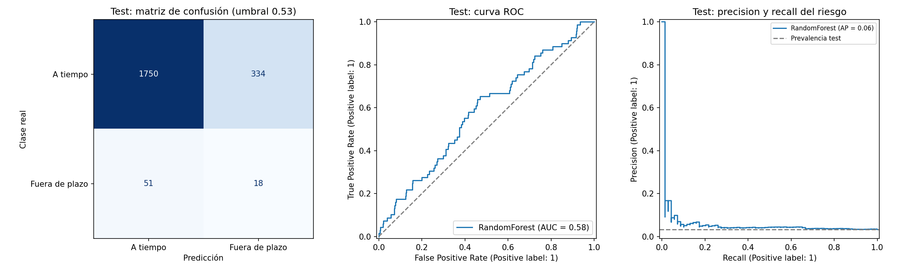

# Credit Payment MLOps

### Predicción de comportamiento de pago y ciclo de vida de modelos de Machine Learning

**Python 3.12 · pandas · scikit-learn · FastAPI · Streamlit · pytest · Docker · Jenkins**

Proyecto integrador del **Módulo 5 de Ciencia de Datos — SoyHenry**, desarrollado para aplicar principios de MLOps a un problema de clasificación de créditos. Integra preparación de datos, análisis exploratorio, entrenamiento, evaluación temporal, predicción mediante API e interfaz web y monitoreo de distribuciones.

El proyecto conecta el análisis con una implementación reproducible: las transformaciones y el modelo se guardan juntos, las métricas son trazables y las principales funciones cuentan con pruebas automatizadas.

> **Estado:** prototipo académico con notebooks ejecutados y 20 pruebas funcionales aprobadas en la validación del paquete. El desempeño predictivo es limitado. Docker, Jenkins y SonarCloud cuentan con archivos de configuración; su ejecución externa está pendiente.

[Resultados](#resultados) · [Estructura](#estructura-del-proyecto) · [Instalación](#instalación-y-ejecución) · [API y aplicación](#api-y-aplicación) · [Validación](VALIDACION.md) · [Guía de repaso](GUIA_DE_REPASO.md)

## Problema y objetivo

Una empresa financiera necesita anticipar el comportamiento de pago de nuevas solicitudes a partir de información histórica de créditos. El objetivo del proyecto es construir y evaluar un flujo de Machine Learning que permita estudiar la detección de pagos fuera de plazo y servir sus predicciones de manera consistente.

La variable objetivo es `Pago_atiempo`. Se adopta la siguiente interpretación, pendiente de confirmación mediante un diccionario oficial:

| Valor original | Interpretación asumida | Clase interna del modelo |
|---|---|---|
| `Pago_atiempo = 1` | Pago a tiempo | `riesgo = 0` |
| `Pago_atiempo = 0` | Pago fuera de plazo | `riesgo = 1` |

La transformación utilizada es **`riesgo = 1 - Pago_atiempo`**. Por lo tanto, precision, recall, F1 y F2 se reportan para la clase de pago fuera de plazo.

El prototipo estudia una posible priorización de revisión. No automatiza la aprobación de créditos ni supone que un atraso equivalga a incumplimiento definitivo.

## Alcance y tecnologías

| Etapa | Implementación | Herramientas |
|---|---|---|
| Preparación | Lectura de Excel, revisión de calidad y exportación a CSV | pandas, openpyxl |
| Exploración | Análisis univariable, bivariable y multivariable | Jupyter, Matplotlib, seaborn |
| Ingeniería | Reglas de limpieza, cocientes, imputación y codificación | Pipeline, ColumnTransformer |
| Modelado | Regresión logística, Random Forest y modelo base | scikit-learn |
| Evaluación | Validación cruzada temporal, umbral y test posterior | TimeSeriesSplit, GridSearchCV |
| Inferencia | Contrato de entrada y predicción compartida | FastAPI, Pydantic, joblib |
| Interfaz | Formulario, métricas y monitoreo | Streamlit |
| Monitoreo | PSI, faltantes y métricas con etiquetas | pandas, NumPy |
| Calidad | Pruebas de datos, predicción, API y formulario | pytest, TestClient, AppTest |
| Automatización | Orquestación local y configuración de CI | Python, Jenkins |
| Empaquetado | Definición de imagen para servir el modelo | Dockerfile |

## Datos

La fuente es [`Base_de_datos.xlsx`](Base_de_datos.xlsx), hoja `Hoja1`, proporcionada para el proyecto. El notebook de carga genera [`Base_de_datos.csv`](Base_de_datos.csv) y verifica la conservación de valores y faltantes, considerando que CSV no conserva tipos mixtos de la misma forma que Excel.

| Característica | Valor |
|---|---:|
| Registros | 10.763 |
| Columnas | 23 |
| Periodo observado | 26/11/2024–26/04/2026 |
| Pagos a tiempo, según la codificación asumida | 10.252 — 95,25 % |
| Pagos fuera de plazo | 511 — 4,75 % |
| Filas completamente duplicadas | 0 |
| Columnas con datos faltantes | 8 |

Entre los hallazgos de calidad aparecen 150 edades superiores a 100, 24 ingresos declarados iguales a cero y categorías numéricas mezcladas con texto en `tendencia_ingresos`. Las columnas `promedio_ingresos_datacredito` y `tendencia_ingresos` tienen 2.930 y 2.932 faltantes, respectivamente.

La fuente no documenta la moneda, las unidades de todos los montos, el horizonte del objetivo ni la fecha de disponibilidad de cada variable. Cada fila se trata como un crédito; no existe un identificador que permita verificar clientes repetidos.

## Estructura del proyecto

La raíz `credit-payment-mlops/` cumple el papel de la carpeta principal indicada en la consigna. El código se concentra en `src/`, conservando los nombres de los notebooks y scripts principales. Los archivos de ejecución y documentación se encuentran en la raíz.

### Raíz del repositorio

| Archivo | Función |
|---|---|
| `README.md` | Presentación, metodología y guía de ejecución |
| `Base_de_datos.xlsx` | Fuente original |
| `Base_de_datos.csv` | Datos exportados para el pipeline |
| `requirements.txt` | Versiones de las dependencias principales |
| `set_up.bat` | Creación del entorno e instalación en Windows |
| `run_pipeline.py` | Ejecución de notebooks, entrenamiento, monitoreo y pruebas |
| `Dockerfile` | Definición de imagen para la API y, opcionalmente, Streamlit |
| `Jenkinsfile` | Configuración de integración continua |
| `sonar-project.properties` | Configuración inicial de SonarCloud |
| `.gitignore` | Exclusiones de versionado |
| `.dockerignore` | Exclusiones del contexto de construcción |
| `.coveragerc` | Configuración de cobertura |
| `coverage.xml` | Reporte generado para análisis de cobertura; excluido de Git por defecto |
| `VALIDACION.md` | Evidencia de verificaciones y límites del entorno |
| `GUIA_DE_REPASO.md` | Explicaciones, ejercicios y preparación de la defensa |

### Código en `src/`

| Archivo | Función |
|---|---|
| [`Cargar_datos.ipynb`](src/Cargar_datos.ipynb) | Carga, comprobaciones iniciales y exportación |
| [`comprension_eda.ipynb`](src/comprension_eda.ipynb) | Exploración del conjunto de entrenamiento |
| [`fe_engineering.py`](src/fe_engineering.py) | Selección de variables, limpieza y pipeline de transformaciones |
| [`model_training_evaluation.py`](src/model_training_evaluation.py) | Entrenamiento, selección, evaluación y guardado del modelo |
| [`model_monitoring.py`](src/model_monitoring.py) | Comparación de distribuciones y evaluación de lotes etiquetados |
| [`model_deploy.py`](src/model_deploy.py) | API y función de predicción compartida |
| [`app.py`](src/app.py) | Aplicación Streamlit |
| [`test_project.py`](src/test_project.py) | Suite de pruebas automatizadas |
| `__init__.py` | Definición del paquete Python |
| `config.json` | Identificador descriptivo; no controla los hiperparámetros |
| [`example_request.json`](src/example_request.json) | Solicitud de ejemplo para la API |

<details>
<summary><strong>Artefactos generados en src/</strong></summary>

| Archivo | Contenido |
|---|---|
| `model.joblib` | Pipeline ajustado, umbral y metadatos |
| `metrics.json` | Comparación de candidatos, métricas y trazabilidad |
| `evaluation.png` | Matriz de confusión, curva ROC y curva precision–recall |
| `reference_data.csv` | Variables de entrenamiento utilizadas como referencia |
| `monitoring_sample.csv` | Test histórico utilizado en la demostración de monitoreo |
| `monitoring_report.json` | PSI, faltantes y métricas disponibles |
| `test_predictions.csv` | Scores, alertas y etiquetas del test |

</details>

Los archivos complementarios de interfaz, pruebas e infraestructura apoyan los avances de despliegue. La aceptación exacta de la estructura por el validador Jenkins institucional permanece pendiente de comprobación.

## Metodología

### 1. Separación temporal

Se ordenan los registros por `fecha_prestamo` y se construyen tres conjuntos aproximadamente 60/20/20. La misma fecha-hora no se reparte entre conjuntos.

| Conjunto | Registros | Casos de riesgo | Periodo |
|---|---:|---:|---|
| Entrenamiento | 6.457 | 350 | 26/11/2024–25/04/2025 |
| Validación | 2.153 | 92 | 25/04/2025–12/07/2025 |
| Test | 2.153 | 69 | 12/07/2025–26/04/2026 |

Los días de corte pueden aparecer en dos filas, pero las horas no se superponen. Los límites completos están registrados en [`src/metrics.json`](src/metrics.json).

El EDA que orienta las decisiones se realiza sobre entrenamiento. La separación temporal aproxima la evaluación con solicitudes posteriores, aunque no resuelve la posible repetición de clientes ni la maduración desconocida de las etiquetas.

### 2. Ingeniería de características

Se utilizan ocho variables bajo el supuesto de disponibilidad al solicitar el crédito:

`tipo_credito`, `capital_prestado`, `plazo_meses`, `edad_cliente`, `tipo_laboral`, `salario_cliente`, `total_otros_prestamos` y `cuota_pactada`.

Se generan tres relaciones: **cuota/ingreso**, **capital/ingreso** y **otros préstamos/ingreso**, suponiendo unidades comparables.

El pipeline aplica:

- Conversión a faltantes de valores negativos y de edades fuera del rango operativo asumido de 18–100 años.
- Tratamiento del cero como faltante en capital, plazo, salario y cuota, evitando divisiones por cero.
- Imputación numérica con medianas e indicadores de faltantes.
- Escalado con `RobustScaler` y codificación de categorías con `OneHotEncoder`.

Las medianas y escalas se ajustan dentro de cada fold de entrenamiento. Los extremos positivos se conservan porque no existe evidencia suficiente para corregirlos.

Se excluyen puntajes, saldos e indicadores de buró cuya procedencia o disponibilidad temporal no está confirmada. Es una decisión conservadora: evita depender de campos potencialmente posteriores al resultado, pero también puede descartar información predictiva legítima.

### 3. Selección del modelo y del umbral

Se comparan regresión logística y Random Forest con `GridSearchCV` y tres folds de `TimeSeriesSplit` sobre entrenamiento. Ambos utilizan ponderación de clases. El criterio de selección es **average precision (AP)**, relevante para evaluar el ranking de la clase minoritaria.

Después se selecciona el umbral que maximiza **F2 en validación**, entre 0,01 y 0,99. Esta preferencia da más peso al recall, sin representar todavía una optimización de costos del negocio.

El modelo y el umbral se congelan antes de evaluar test. El pipeline final permanece ajustado solo con entrenamiento: no se vuelve a entrenar con validación después de elegir el umbral.

## Resultados

### Comparación en validación cruzada

| Modelo | AP media en CV temporal | Mejores parámetros probados |
|---|---:|---|
| Regresión logística | 0,0822 | `C=0.1` |
| **Random Forest** | **0,1018** | `max_depth=5`, `min_samples_leaf=30` |

El modelo seleccionado utiliza **150 árboles** y un **umbral de 0,53**.

### Evaluación en test temporal

| Métrica | Random Forest | Modelo base constante |
|---|---:|---:|
| Accuracy | 82,12 % | 96,80 % |
| Precision del riesgo | 5,11 % | 0,00 % |
| Recall del riesgo | 26,09 % | 0,00 % |
| F1 del riesgo | 0,0855 | 0,0000 |
| F2 del riesgo | 0,1433 | 0,0000 |
| ROC-AUC | 0,5827 | 0,5000 |
| Average precision | 0,0614 | 0,0320 |
| Proporción de alertas | 16,35 % | 0,00 % |



| Clase real / Predicción | A tiempo | Fuera de plazo |
|---|---:|---:|
| A tiempo | 1.750 — TN | 334 — FP |
| Fuera de plazo | 51 — FN | 18 — TP |

**Interpretación:** se detectan 18 de los 69 casos fuera de plazo y se generan 334 falsas alertas. En total, 352 de 2.153 créditos quedarían marcados para revisión.

El modelo base obtiene mayor accuracy porque siempre predice pago a tiempo, pero no identifica ningún atraso. Random Forest mejora el ranking respecto de ese punto de referencia, aunque su baja precision y su recall limitado no justifican su uso operativo. Ser el mejor candidato evaluado no implica ser un modelo suficientemente bueno.

## Instalación y ejecución

### Requisitos

Python **3.12**, Git y acceso a las dependencias de [`requirements.txt`](requirements.txt). Para trabajar con notebooks en VS Code, utilizar las extensiones de Python y Jupyter. Docker solo es necesario para construir y ejecutar el contenedor.

### Preparar el proyecto

Clona el repositorio una sola vez y abre su raíz:

```bash
git clone https://github.com/Dcuastumal/credit-payment-mlops.git
cd credit-payment-mlops
```

Si trabajas con el paquete descargado, extrae los archivos y abre esa carpeta. Los comandos siguientes requieren que el código y los datos estén presentes en la raíz y en `src/` según la estructura descrita.

**Windows — PowerShell:**

```powershell
.\set_up.bat
.\.venv\Scripts\python.exe run_pipeline.py
```

El script crea `.venv`, instala dependencias, comprueba su consistencia y registra el kernel **Python - Credit Payment MLOps**. Los comandos usan el intérprete del entorno directamente; no requieren activar PowerShell.

**Linux/macOS:**

```bash
python3.12 -m venv .venv
.venv/bin/python -m pip install -r requirements.txt
.venv/bin/python run_pipeline.py
```

### Qué ejecuta el pipeline

1. Notebook de carga y exportación a CSV.
2. Notebook de EDA.
3. Entrenamiento y evaluación.
4. Monitoreo histórico de demostración.
5. Pruebas y reporte de cobertura.

El proceso se detiene si una etapa falla. La ejecución regenera las salidas de los notebooks y los artefactos del modelo.

Si el entorno impide iniciar un kernel por sockets, está disponible la ejecución de celdas Python en el mismo proceso:

```powershell
.\.venv\Scripts\python.exe run_pipeline.py --in-process
```

Para omitir notebooks cuando el CSV ya está preparado:

```powershell
.\.venv\Scripts\python.exe run_pipeline.py --skip-notebooks
```

Esta última opción **sí vuelve a entrenar el modelo**. Para revisar solo las pruebas, utiliza el comando de la sección de calidad.

## API y aplicación

Las dos interfaces utilizan `predict_credit` y el mismo pipeline serializado. Streamlit puede funcionar sin levantar la API.

### FastAPI

Desde la raíz, en una terminal:

```powershell
.\.venv\Scripts\python.exe -m uvicorn src.model_deploy:app --host 127.0.0.1 --port 8000
```

Documentación interactiva: [http://127.0.0.1:8000/docs](http://127.0.0.1:8000/docs).

| Método | Ruta | Función |
|---|---|---|
| `GET` | `/health` | Comprueba que puede cargarse el modelo |
| `POST` | `/predict` | Valida la solicitud y devuelve score, umbral y alerta |

Solicitud de ejemplo, también disponible en [`src/example_request.json`](src/example_request.json):

```json
{
  "tipo_credito": 4,
  "capital_prestado": 2000000,
  "plazo_meses": 12,
  "edad_cliente": 40,
  "tipo_laboral": "Empleado",
  "salario_cliente": 3000000,
  "total_otros_prestamos": 1000000,
  "cuota_pactada": 200000
}
```

`edad_cliente` y `salario_cliente` aceptan `null`; el pipeline utiliza las estadísticas aprendidas en entrenamiento. Las entradas fuera del contrato y los campos adicionales se rechazan con HTTP 422. Si falta el artefacto del modelo, los endpoints devuelven HTTP 503.

| Campo de salida | Significado |
|---|---|
| `score_riesgo` | Score entre 0 y 1; no es una probabilidad calibrada |
| `umbral` | Corte elegido en validación |
| `alerta_revision` | `true` si el score es igual o superior al umbral |
| `Pago_atiempo_predicho` | `0` para alerta y `1` para score inferior al umbral |
| `modelo` | Nombre del modelo seleccionado |
| `nota` | Aclaración del alcance académico |

### Streamlit

En otra terminal:

```powershell
.\.venv\Scripts\python.exe -m streamlit run src/app.py
```

Abre [http://localhost:8501](http://localhost:8501). La aplicación ofrece tres pestañas: **Predicción**, **Resultados** y **Monitoreo**. La tercera muestra el reporte guardado; no representa una conexión a datos de producción en tiempo real.

Después de reentrenar, reinicia la API y Streamlit para cargar el nuevo artefacto.

## Monitoreo

El módulo compara un lote con las variables de entrenamiento mediante **Population Stability Index (PSI)** y proporciones de faltantes. Si el lote incluye `Pago_atiempo`, calcula métricas sobre las filas etiquetadas e informa su proporción.

**Demostración con test histórico:**

```powershell
.\.venv\Scripts\python.exe -m src.model_monitoring
```

**Lote nuevo:**

```powershell
.\.venv\Scripts\python.exe -m src.model_monitoring --current nuevos_creditos.csv --output monitoreo_nuevo.json
```

El lote debe contener las ocho variables originales utilizadas por el modelo. El segundo comando escribe un reporte separado; para actualizar el que muestra Streamlit, utiliza `--output src/monitoring_report.json`.

| PSI | Estado implementado |
|---|---|
| Menor que 0,10 | Estable |
| Desde 0,10 hasta menos de 0,20 | Observar |
| Desde 0,20 | Revisar |

Son umbrales heurísticos, no pruebas de significancia ni límites universales. El reporte incluido compara entrenamiento con test histórico y señala `plazo_meses` (PSI ≈ 0,388) y `otros_prestamos_ingreso` (PSI ≈ 0,278) para revisión.

Una alerta requiere investigar población, calidad y origen de los datos. El proyecto no reentrena automáticamente por detectar drift.

## Calidad, automatización y despliegue

### Pruebas

```powershell
.\.venv\Scripts\python.exe -m pytest src/test_project.py -q --cov=src --cov-report=term-missing --cov-report=xml
```

La validación registrada obtuvo **20 pruebas aprobadas** y **68,37 % de cobertura del código fuente**, excluyendo el archivo de pruebas. Se verificaron separación temporal, imputación, independencia de features respecto del objetivo, serialización, métricas, PSI, entradas de API y envío del formulario Streamlit.

La cobertura no mide ausencia de errores ni incluye toda la ejecución previa de notebooks y entrenamiento. El detalle, incluidas dos advertencias de deprecación de dependencias, está en [`VALIDACION.md`](VALIDACION.md).

### Docker

El Dockerfile define una imagen con Python 3.12, dependencias, código y modelo. Configura un usuario no root y un healthcheck para la API.

```powershell
docker build -t credit-payment-mlops:1.2.0 .
docker run --rm -p 127.0.0.1:8000:8000 credit-payment-mlops:1.2.0
```

Para ejecutar Streamlit con esa definición de imagen:

```powershell
docker run --rm --no-healthcheck -p 127.0.0.1:8501:8501 credit-payment-mlops:1.2.0 python -m streamlit run src/app.py --server.address 0.0.0.0 --server.port 8501
```

`--no-healthcheck` desactiva el chequeo de la API en el modo Streamlit. **La imagen aún no fue construida ni probada en la validación disponible.** La etiqueta del ejemplo es local y no acredita una release publicada.

### Jenkins y SonarCloud

[`Jenkinsfile`](Jenkinsfile) define preparación del entorno, ejecución del pipeline y archivo de resultados. Requiere configurar un job con un agente Linux que tenga Python 3.12.

Para el extra credit, [`sonar-project.properties`](sonar-project.properties) incluye las rutas del código, pruebas y cobertura. Antes de ejecutar SonarScanner, se deben completar `sonar.projectKey` y `sonar.organization`, generar `coverage.xml` y configurar `SONAR_TOKEN` como credencial externa al repositorio.

```bash
sonar-scanner -Dsonar.host.url=https://sonarcloud.io
```

No se ha ejecutado Jenkins ni un análisis SonarCloud en la validación documentada; no se acredita un quality gate aprobado.

### Estado verificable

| Componente | Estado documentado |
|---|---|
| Notebooks | Ejecutados con `--in-process`; tablas y gráficos guardados |
| Entrenamiento y monitoreo | Ejecutados con la fuente entregada |
| API | Probada con TestClient |
| Streamlit | Probada con AppTest, incluido el formulario |
| Instalación Windows y kernel convencional | Pendientes de comprobación local |
| Docker | Definición incluida; construcción y ejecución pendientes |
| Jenkins / SonarCloud | Configuraciones incluidas; integración externa pendiente |

## Versionado y reproducibilidad

El flujo previsto utiliza **`developer`** para desarrollo, **`certification`** para validación y **`master`** para integrar los cambios aprobados. Las ramas, pull requests y etiquetas deben corresponder a cambios realmente publicados; este README no certifica el estado remoto de esas entregas.

La consigna contempla V1.0.0 para estructura, V1.0.1 para carga y EDA, y V1.1.0/V1.1.1 para ingeniería y modelado.

La ejecución registra en `metrics.json` la semilla **42**, el hash SHA-256 del CSV, los límites temporales, las versiones principales, los parámetros seleccionados y las métricas. Se utiliza un único pipeline para entrenamiento e inferencia y rutas relativas para facilitar su reproducción.

Las dependencias principales están fijadas en `requirements.txt`; no se incluye un lock completo de transitivas. La validación disponible corresponde a Linux y Python 3.12.14.

## Limitaciones y próximos pasos

El aporte del proyecto es la integración de un proceso de Machine Learning trazable, evaluable y ejecutable. Los resultados muestran que el modelo todavía necesita mejoras antes de considerar un uso operativo.

Prioridades:

1. Confirmar la codificación, el horizonte y la maduración de `Pago_atiempo`.
2. Documentar las unidades monetarias y revisar valores anómalos.
3. Confirmar la disponibilidad temporal de las variables excluidas antes de incorporarlas.
4. Obtener identificadores de cliente para controlar repeticiones entre conjuntos.
5. Definir costos de falsas alertas y atrasos no detectados, y capacidad de revisión.
6. Calibrar scores y evaluar estabilidad y desempeño por grupos pertinentes.
7. Evaluar cualquier modelo revisado con un nuevo periodo futuro, sin reutilizar el test para ajustarlo.
8. Completar las verificaciones de Docker, Jenkins y SonarCloud.

## Documentación y contacto

- [Guía de repaso y defensa](GUIA_DE_REPASO.md)
- [Validación técnica y pendientes](VALIDACION.md)
- [Resultados y metadatos](src/metrics.json)
- [Reporte de monitoreo](src/monitoring_report.json)

**David Cuastumal** · [GitHub](https://github.com/Dcuastumal)  
Proyecto integrador académico · SoyHenry · Ciencia de Datos
